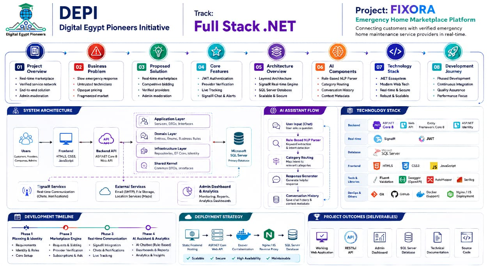
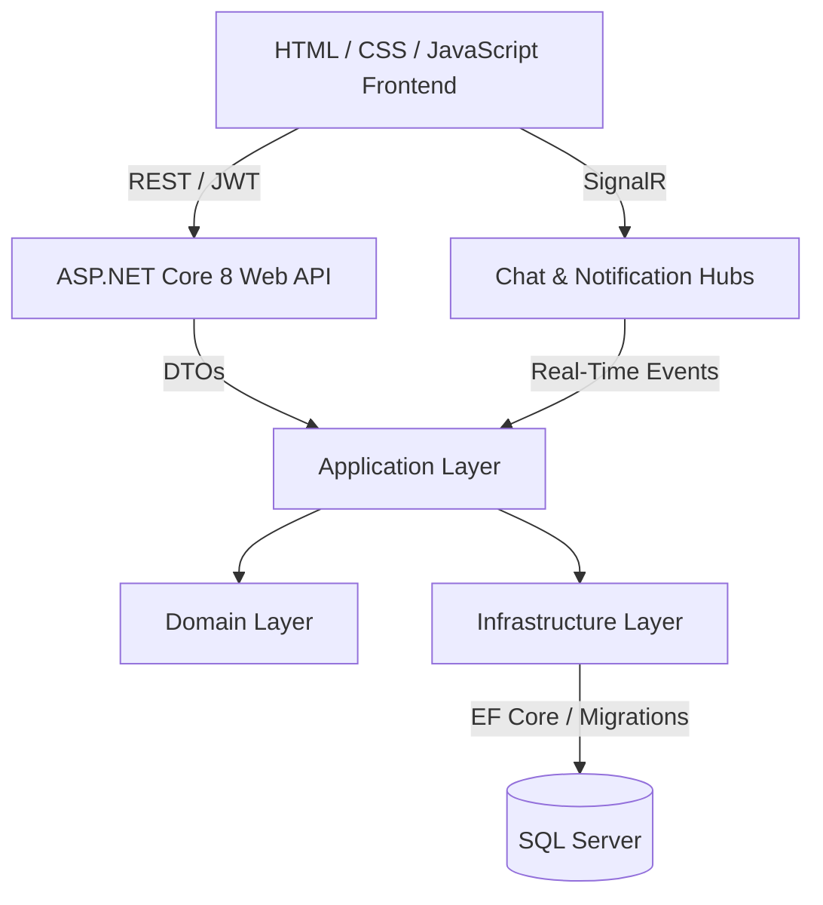

# Fixoara

[](#)
[](#)
[](#)
[](#)
[](#)
[](#)
[](#)

Fixoara is a next-generation marketplace platform connecting customers with emergency home maintenance service providers. It is designed as a high-performance, real-time, and role-secured application covering the complete service lifecycle from registration and profile verification to service requests, bidding, execution tracking, communication, and ratings.

---

## 1. Project Overview

### The Problem

Finding reliable home maintenance services during emergencies such as plumbing leaks, electrical issues, or AC failures can be stressful, slow, and lack transparency. Customers may struggle to compare offers, while service providers need streamlined ways to bid on jobs, verify credentials, and manage service execution.

### The Solution

Fixoara bridges this gap through a real-time marketplace. Customers can post emergency home service requests, while verified service providers can submit competitive offers. Real-time chat, live tracking, status synchronization, and review systems improve transparency and efficiency.

---

## 2. Key Features

- **Authentication & Security**: JWT authentication, refresh token support, password protection, and role-based authorization.
- **Provider Verification**: Document upload and administrative review workflows for provider onboarding.
- **Subscription System**: Tiered subscription plans for service providers with expiration and billing management.
- **Service Request Lifecycle**: Complete workflow from request creation to provider selection, examination, execution, and completion.
- **Competitive Bidding**: Providers can submit offers for customer service requests.
- **Real-Time Communication**: SignalR-based chat and real-time status notifications.
- **Live Status Updates**: Real-time synchronization of service and request statuses.
- **Ratings & Reviews**: Customers can evaluate completed services.
- **Analytics & Reporting**: Administrative statistics, revenue tracking, user growth, and performance reports.
- **AI-Assisted Interaction**: Rule-based NLP and intent detection components.

---

## 3. System Architecture

Fixoara follows a layered backend architecture that separates responsibilities between the Domain, Application, Infrastructure, and API layers.

### Architecture Overview



### Architecture Diagram



### Architecture Details

1. **Frontend Architecture**: Client-side Vanilla JavaScript architecture using modular components.
2. **Domain Layer**: Contains persistent entities, value objects, domain enums, and core business rules.
3. **Application Layer**: Contains DTOs, service contracts, business logic, mappings, validation, and application services.
4. **Infrastructure Layer**: Contains EF Core DbContext, migrations, persistence, file storage, and external service implementations.
5. **API Layer**: Contains REST controllers, middleware, authentication, authorization, and SignalR hubs.

---

## 4. Tech Stack

### Frontend

- HTML5
- CSS3
- Vanilla JavaScript (ES6+)
- Custom CSS variables
- Dark mode support

### Backend

- C#
- ASP.NET Core 8 Web API
- Entity Framework Core 8
- ASP.NET Core Identity
- JWT Authentication
- SignalR

### Database

- Microsoft SQL Server

### Tools & Libraries

- Swagger / OpenAPI
- FluentValidation
- AutoMapper
- Serilog
- Git
- GitHub
- Visual Studio
- VS Code
- Docker
- Nginx / IIS

---

## 5. AI-Assisted Components

Fixoara includes an AI-assisted interaction component designed to improve user interaction with the platform.

The system includes:

- Rule-Based NLP Parser
- Keyword Extraction
- Intent Detection
- Category Routing
- Response Generation
- Conversation History
- Context Metadata

---

## 6. Project Folder Structure

```text
Fixoara/
│
├── Backend_depi/
│   ├── src/
│   │   ├── HomeEmergency.Domain/
│   │   │   └── Entities, Enums, Domain Logic
│   │   ├── HomeEmergency.Application/
│   │   │   └── Interfaces, DTOs, Services, Validation
│   │   ├── HomeEmergency.Infrastructure/
│   │   │   └── EF Core DbContext, Migrations, Persistence
│   │   └── HomeEmergency.API/
│   │       └── Controllers, SignalR Hubs, Program.cs
│   ├── tests/
│   │   └── HomeEmergency.Tests/
│   └── HomeEmergency.sln
│
├── fixora/
│   ├── css/
│   ├── html/
│   └── js/
│
└── README.md
```

---

## 7. User Roles & Permissions

| Role | Permissions & Workflows |
|---|---|
| **Customer** | Create requests, view and compare provider bids, assign technicians, track executions, chat live, and rate services. |
| **Provider** | Browse requests, submit bids, upload verification documents, purchase plans, execute jobs, and manage services. |
| **Company** | Manage a corporate provider account, multiple technicians, and subscription limits. |
| **Admin** | Manage users, verification documents, categories, plans, warnings, access control, and analytics. |

---

## 8. Main Business Flow

```text
Provider Registration
        ↓
Upload Verification Documents
        ↓
Admin Review & Approval
        ↓
Provider Subscription
        ↓
Customer Creates Service Request
        ↓
Providers Submit Bids / Offers
        ↓
Customer Selects Provider
        ↓
Provider Performs Examination
        ↓
Examination Report Submission
        ↓
Customer Approves Report
        ↓
Service Execution
        ↓
Service Completion
        ↓
Customer Rating & Review
```

---

## 9. Real-Time Communication

Fixoara uses **ASP.NET Core SignalR** for real-time communication and status synchronization.

### Chat Hub

The Chat Hub connects active users to real-time conversation channels and enables instant messaging.

### Notification Hub

The Notification Hub connects authenticated users to personal notification groups and delivers:

- Service updates
- Bid notifications
- Status changes
- System announcements

### Reconnection Resiliency

The frontend handles SignalR reconnection to maintain communication during temporary network interruptions.

---

## 10. Security

Fixoara implements multiple security mechanisms:

- **JWT Authentication**: Short-lived, cryptographically signed access tokens.
- **Refresh Tokens**: Automatic token renewal.
- **Role-Based Authorization**: Protected backend endpoints and role-specific access control.
- **ASP.NET Core Identity**: User identity and authentication management.
- **File Upload Validation**: File size, extension, and MIME/content validation.

---

## 11. Core API Endpoints Reference

| Endpoint | Method | Role | Description |
|---|---|---|---|
| `/api/auth/register` | POST | Public | Register a new user |
| `/api/auth/login` | POST | Public | Authenticate user and return JWT + Refresh Token |
| `/api/service-requests` | GET | Admin, Provider | List all service requests |
| `/api/service-requests` | POST | Customer | Post a new service request |
| `/api/provider-offers` | POST | Provider | Submit a bid offer on a request |
| `/api/admin/users/search` | GET | Admin | Search and filter system accounts |
| `/api/admin/documents/pending` | GET | Admin | List pending provider verification uploads |
| `/api/admin/analytics/users` | GET | Admin | Retrieve user growth statistics |

---

## 12. Database Entity Mappings

The persistence layer uses Entity Framework Core to manage relationships between the main application entities.

### One-to-One

- `ApplicationUser` → `CustomerProfile`
- `ApplicationUser` → `ProviderProfile`
- `ApplicationUser` → `CompanyProfile`

### One-to-Many

- `Category` → `ServiceRequest`
- `ApplicationUser` → `UserWarning`
- `Chat` → `Message`

### Many-to-Many

- `Chat` ↔ Users
- Managed through the `ChatParticipant` joining table.

---

## 13. My Contribution

### Core Service System — Backend

I contributed to the backend development of Fixoara as part of the **Core Service System**.

My contribution included:

- Developing backend APIs for core service functionality.
- Implementing service-related business logic.
- Working with specific domain entities and their relationships.
- Designing and implementing service-related API endpoints.
- Integrating backend services with Entity Framework Core.
- Working with Microsoft SQL Server.
- Implementing and working with authentication and authorization.
- Applying role-based access control to protected functionality.
- Following the project's layered architecture.
- Integrating the Core Service System with the rest of the application.

---

## 14. Screenshots

### Admin Dashboard


### Provider Marketplace


### Real-Time Chat


> More screenshots can be added to showcase the application's main workflows and user interface.

---

## 15. Installation & Run Guide

### Prerequisites

- .NET 8 SDK
- Microsoft SQL Server
- Visual Studio or VS Code
- IIS or a local static server
- Git

### Backend Setup

Navigate to the backend directory:

```bash
cd Backend_depi
```

Restore dependencies:

```bash
dotnet restore
```

Build the project:

```bash
dotnet build
```

### Database Configuration

Configure the SQL Server connection string in:

```text
src/HomeEmergency.API/appsettings.json
```

Example:

```json
"ConnectionStrings": {
    "DefaultConnection": "Server=(localdb)\\mssqllocaldb;Database=HomeEmergencyDb;Trusted_Connection=True;"
}
```

> Replace the example connection string with your own local SQL Server configuration. Never commit real passwords, API keys, or other secrets.

### Apply Migrations

```bash
dotnet ef database update --project src/HomeEmergency.Infrastructure --startup-project src/HomeEmergency.API
```

### Run the Backend

```bash
dotnet run --project src/HomeEmergency.API
```

### Frontend Setup

Open:

```text
fixora/
```

Configure the backend URL in:

```text
fixora/js/config.js
```

Example:

```javascript
const CONFIG = {
    API_BASE_URL: "http://localhost:5000/api/",
    HUB_BASE_URL: "http://localhost:5000/hubs/"
};
```

Run the frontend using a local development server such as **VS Code Live Server**.

---

## 16. Testing

### Build

```bash
dotnet build
```

### Unit Tests

```bash
dotnet test
```

---

## 17. Project Status

**Version:** `v1.0.0`

**Status:** Completed

---

## 18. Contributors

- **Technical Lead & Architect:** Salma H.
- **Development Team:** Home Emergency Project contributors.

---

## 19. License

This project is licensed under the MIT License.

See the `LICENSE` file for more information.

---

## 20. Project Information

**Fixoara — Emergency Home Services Marketplace**

A full-stack .NET project focused on:

- Real-time communication
- Secure backend architecture
- Emergency service management
- Provider verification
- Competitive bidding
- Scalable web application development
- AI-assisted interaction
